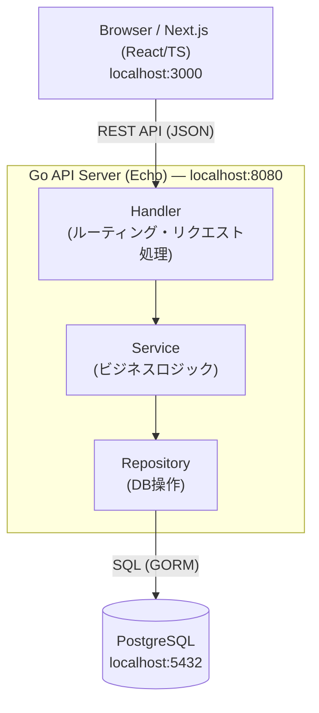

# システムアーキテクチャ

## 概要

> **設計原則**: 開発はローカル、運用はGCP等のクラウド。詳細は [principles.md](principles.md) を参照。

**Issue 管理**を主目的とする。Jira / Redmine ライクなチケット・カンバンを扱う。  
Go 製 REST API + Next.js フロントエンド + PostgreSQL の3層構成。  
マルチテナント対応（組織ごとにデータを分離）。

**ステータス遷移の権限**（誰が Close 等を行えるか）は、稟議・承認ワークフローとは別概念として [transition-permissions.md](transition-permissions.md) で整理する。

---

## システム構成図



---

## マルチテナント構成

| 種別 | 説明 |
|------|------|
| **SuperAdmin** | システム全体の管理者。組織の作成のみ可能。メールアドレスのみでログイン。 |
| **Organization** | 会社・組織。プロジェクト・役職・ユーザーは組織に紐づく。 |
| **User** | 1ユーザー＝1組織。`organization_id` で所属組織、`is_org_admin` で組織管理者を識別。 |
| **組織管理者** | 所属組織内のユーザー作成・更新・削除、管理画面へのアクセスが可能。 |

---

## テナント認可ポリシー（仕様）

- マルチテナント方式を堅持し、`organization_id`（所属組織）に基づくアクセス制御を必須とする。
- スーパーアドミン以外に対しては、管理画面を含む全ページで「所属組織データのみ」をバックエンドが返すことを原則とする。
- 認証は JWT を使用し、フロントエンドではトークンをメモリ（State/Context）で扱う。リロード時のセッション維持とログアウト対策として `sessionStorage` を併用する（マルチセッション維持）。

### 不変条件（正本）

詳細は **[tenant-invariants.md](tenant-invariants.md)** を参照。

- **テナントの壁はサーバ**（フロントの表示用フィルタは代わりにならない）。
- **非スーパーアドミン**は JWT の `organization_id` だけが正。
- **親子 API**（例: ワークフロー配下のステータス）は、親が自社に属するか確認してから、子を親 ID で列挙する。
- **スーパーアドミン**の一覧は `org_id` なしで全件になり得る。単一社の画面ではクエリで `org_id` を付け、**サーバが**その会社だけ返す。

### 現行実装との整合メモ

- 上記はシステム全体の必須方針（ターゲット仕様）。
- 現行実装では、主要な管理系 API（projects/statuses/departments/users/admin-users/issues/templates 等）で JWT 前提の組織スコープ制御を適用している。
- **GET /workflows** は非スーパーアドミンで JWT 組織にフィルタ済み。スーパーアドミン向けにクエリ `org_id` で組織絞り込み可能（管理画面の「選択中組織」と整合）。テナント境界のブラックボックステストは [backend/test/TENANT_TEST_MATRIX.md](../backend/test/TENANT_TEST_MATRIX.md) で追跡する。
- 方針に対して適用漏れの可能性があるエンドポイントは、同方針に合わせて継続的に補完する。

---

## 技術スタック

| レイヤー | 技術 | バージョン |
|---------|------|------------|
| フロントエンド | Next.js (App Router) | 14.x |
| UI | Tailwind CSS | 最新 |
| バックエンド | Go + Echo | Go 1.22 / Echo v4 |
| ORM | GORM | v2 |
| データベース | PostgreSQL | 16 |
| コンテナ | Docker Compose | - |
| 認証 | JWT + メールログイン | JWT 実装済み |

---

## ディレクトリ構成

```
project_management_tool/
├── .sdd/                        # 設計ドキュメント
│   ├── README.md                # ナビゲーション
│   ├── architecture.md         # このファイル
│   ├── tenant-invariants.md    # テナント不変条件（正本）
│   ├── transition-permissions.md # ステータス遷移の権限（候補比較）
│   ├── layer-responsibility.md # レイヤー責務定義
│   ├── db-schema.md            # DB設計
│   ├── api-spec.md             # API仕様
│   ├── key-flows.md            # 主要フロー
│   ├── testing.md              # テスト方針
│   └── dev-guide.md            # 開発ガイド
├── backend/                     # Go APIサーバー
│   ├── cmd/
│   │   └── server/
│   │       └── main.go
│   ├── internal/
│   │   ├── handler/             # HTTPハンドラー
│   │   ├── service/             # ビジネスロジック
│   │   ├── repository/         # DB操作
│   │   ├── model/               # データモデル
│   │   └── middleware/         # ミドルウェア
│   ├── test/                    # ブラックボックステスト（インメモリ SQLite）
│   ├── seed.sql                 # 初期データ投入（手動実行）
│   ├── go.mod
│   └── Dockerfile
├── frontend/                    # Next.js
│   ├── src/
│   │   ├── app/                 # App Router
│   │   ├── components/          # UIコンポーネント
│   │   ├── lib/                 # APIクライアント等
│   │   └── types/               # TypeScript型定義
│   ├── package.json
│   └── Dockerfile
├── docker-compose.yml
├── README.md
└── AGENTS.md                    # Cursor 用コンテキスト
```

> **Note:** DB マイグレーションは GORM の AutoMigrate を使用。`migrations/` フォルダは使用していない。

---

## 将来の拡張方針（GCP / AWS 対応）

| 項目 | ローカル | クラウド |
|------|----------|----------|
| DB | Docker PostgreSQL | Cloud SQL / RDS |
| バックエンド | ローカル実行 | Cloud Run / ECS |
| フロントエンド | ローカル実行 | Cloud Run / Amplify |
| 認証 | メールのみ | Firebase Auth / Cognito |
| ストレージ | ローカル | GCS / S3 |
