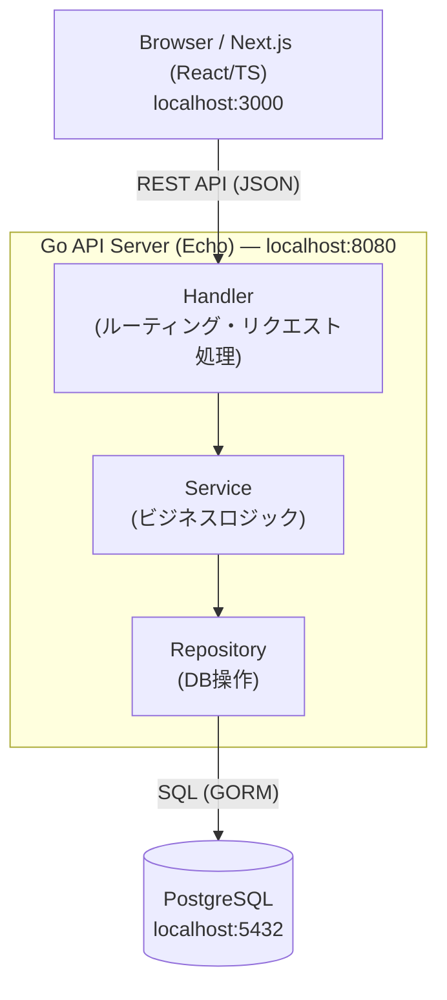

# システムアーキテクチャ

## 概要

Jira / Redmine ライクなチケットベースのプロジェクト管理ツール。  
Go 製 REST API + Next.js フロントエンド + PostgreSQL の3層構成。

---

## システム構成図



---

## 技術スタック

| レイヤー | 技術 | バージョン |
|---|---|---|
| フロントエンド | Next.js (App Router) | 14.x |
| UIコンポーネント | shadcn/ui + Tailwind CSS | 最新 |
| バックエンド | Go + Echo | Go 1.22 / Echo v4 |
| ORM | GORM | v2 |
| データベース | PostgreSQL | 16 |
| コンテナ | Docker Compose | - |
| 認証 | JWT (将来対応) | - |

---

## ディレクトリ構成

```
project_management_tool/
├── .sdd/                        # 設計ドキュメント
│   ├── architecture.md          # このファイル
│   ├── db-schema.md             # DB設計
│   └── api-spec.md              # API仕様
├── backend/                     # Go APIサーバー
│   ├── cmd/
│   │   └── server/
│   │       └── main.go
│   ├── internal/
│   │   ├── handler/             # HTTPハンドラー
│   │   ├── service/             # ビジネスロジック
│   │   ├── repository/          # DB操作
│   │   ├── model/               # データモデル
│   │   └── middleware/          # ミドルウェア
│   ├── migrations/              # DBマイグレーション
│   ├── go.mod
│   └── Dockerfile
├── frontend/                    # Next.js
│   ├── src/
│   │   ├── app/                 # App Router
│   │   ├── components/          # UIコンポーネント
│   │   ├── lib/                 # APIクライアント等
│   │   └── types/               # TypeScript型定義
│   ├── package.json
│   └── Dockerfile
├── docker-compose.yml
└── README.md
```

---

## 将来の拡張方針（GCP / AWS 対応）

| 項目 | ローカル | クラウド |
|---|---|---|
| DB | Docker PostgreSQL | Cloud SQL / RDS |
| バックエンド | ローカル実行 | Cloud Run / ECS |
| フロントエンド | ローカル実行 | Cloud Run / Amplify |
| 認証 | 未実装 | Firebase Auth / Cognito |
| ストレージ | ローカル | GCS / S3 |
