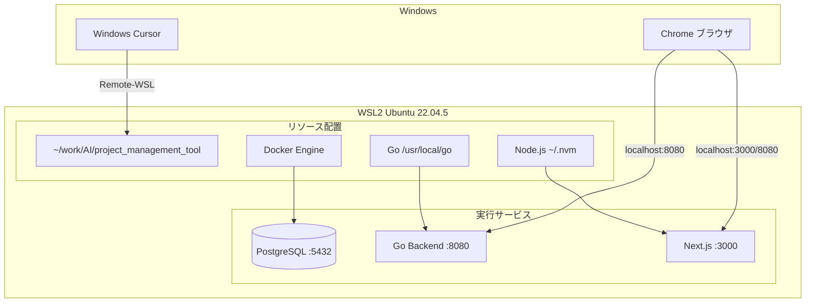

# 開発環境

本プロジェクトの開発環境の構成・リソース配置・使用ツールを定義する。設計原則「開発はローカル、運用はクラウド」に基づく。

---

## 大前提

- **Windows の Docker Desktop は絶対に使用しない**
- **PowerShell は極力使用しない**
- **Windows のブラウザ（Chrome 等）からアプリにアクセスできること**（WSL2 は localhost を自動フォワードするため、特別設定不要）

---

## リソースの配置

| リソース | 配置場所 | 備考 |
|----------|----------|------|
| **Git リポジトリ** | `~/work/AI/project_management_tool`（WSL Ubuntu 内） | GitHub から clone。`/home/<ユーザー>/work/AI/` 配下にプロジェクトごとにフォルダを掘る |
| **ソースコード** | 上記リポジトリ内 | WSL の Linux ファイルシステム上（`/mnt/c/` ではない） |
| **Docker** | WSL Ubuntu 内の Docker Engine | `/var/lib/docker` 等。Docker Desktop は使用しない |
| **PostgreSQL データ** | WSL Docker のボリューム `postgres_data` | `docker compose` で管理 |
| **Go** | `/usr/local/go`（WSL Ubuntu） | バックエンドのビルド・実行 |
| **Node.js** | `~/.nvm/`（WSL Ubuntu） | フロントエンドのビルド・実行 |
| **Next.js** | `frontend/node_modules/`（WSL 内） | `npm install` で導入。package.json の依存関係として管理 |
| **GitHub CLI** | WSL Ubuntu（apt でインストール） | `gh` コマンド |
| **GCP CLI** | `~/google-cloud-sdk/`（WSL Ubuntu） | `gcloud` コマンド。本番デプロイ用 |
| **Cursor** | Windows（`C:\Users\...\AppData\Local\Programs\cursor\`） | エディタ。WSL にリモート接続して使用 |
| **ブラウザ** | Windows（Chrome 等） | `http://localhost:3000` でアクセス |

---

## 使用するリソース

| 役割 | 使用するリソース | 実行場所 |
|------|------------------|----------|
| **データベース** | PostgreSQL 16（Docker イメージ `postgres:16-alpine`） | WSL 内の Docker コンテナ。ポート 5432 |
| **バックエンド** | Go 1.22+ + Echo | WSL 内で `go run ./cmd/server`。ポート 8080 |
| **フロントエンド** | Node.js 20+ + Next.js | WSL 内で `npm run dev`。ポート 3000 |
| **コンテナオーケストレーション** | Docker Compose（V2: `docker compose`） | WSL 内の Docker Engine。DB のみコンテナ化 |
| **ターミナル** | bash（WSL Ubuntu） | Cursor の統合ターミナルは WSL 接続時に自動で bash |
| **バージョン管理** | Git | WSL 内。リポジトリは GitHub から clone |

---

## WSL 側で実行するコマンド

以下のコマンドはすべて **WSL の bash** で実行する（PowerShell は使用しない）:

- `npm install` — フロントエンドの依存関係（Next.js 含む）を `frontend/node_modules/` にインストール
- `npm run dev` — Next.js 開発サーバー起動
- `go run ./cmd/server` — バックエンド起動
- `docker compose up -d db` — PostgreSQL コンテナ起動
- `git clone` / `git pull` 等 — リポジトリ操作

Cursor が WSL に接続済みの場合、統合ターミナルは自動的に bash になるため、そのまま上記コマンドを実行してよい。

---

## アーキテクチャ図

---

## 初回セットアップ

[README.md](../README.md#初回セットアップ) を参照。概要:

1. WSL Ubuntu を用意し、GitHub から clone
2. `bash scripts/setup-wsl.sh` でツールをインストール
3. `sudo service docker start` で Docker を起動
4. Windows で Cursor を起動 → WSL に接続 → `~/work/AI/project_management_tool` を開く

---

## 日常の起動手順

1. `sudo service docker start` で Docker を起動
2. Windows で Cursor を起動 → WSL に接続 → プロジェクトフォルダを開く
3. ターミナルで `bash scripts/start.sh` を実行

詳細は [README.md](../README.md#ローカル起動手順wsl--bash) を参照。
