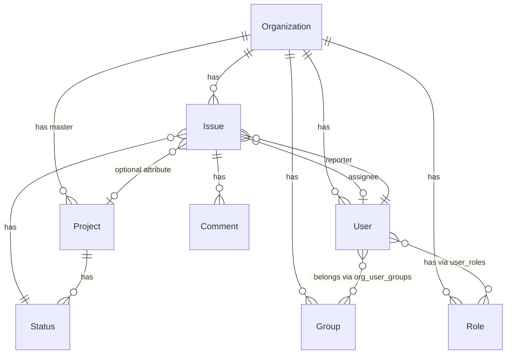

# ドメインモデル・エンティティ関係

エンティティ間の関係と設計方針をまとめたドキュメント。

**プロダクト方針**: 本プロジェクトは **Issue 管理システム**を主目的とする。稟議・承認ワークフロー専用のドメイン（Workflow / 承認ログ等）は **設計の中心から外す**（既存コードは移行・整理対象として扱う）。

**ステータス遷移・遷移アラート・監査**の意味論と、**db-schema / api-spec / 本ドキュメントの役割分担（§5–§7）**は [transition-permissions.md](transition-permissions.md) を参照。

---

## 会社（Organization）

- **プロジェクト**を持つ（1:N、プロジェクトテーブルのマスタ）
- **ユーザー**を持つ（users.organization_id 経由、1:N。1ユーザー＝1組織）
- **グループ**を持つ（1:N）
- **役職（roles）**は補助・既存互換
- **Issue**を持つ（1:N、会社に直接紐づく想定）

---

## グループ（Group）

- 会社に紐づく（organization_id）
- 例: 開発部、営業部、経理部 / 予算委員会、教育委員会
- **ユーザー**を持つ（組織内でユーザーがグループに所属。1ユーザーが複数グループに所属可能 → N:M）

> **Note:** グループは組織構造のための概念。**「営業部の課長のみを想定アクターとする」**のような **グループスコープ付きの表現**は **遷移アラート**や想定の整理に重要になりうる（詳細は [transition-permissions.md](transition-permissions.md)）。

---

## プロジェクト（Project）

- **Issue の一要素**としてのみ存在。Issue 以外のエンティティ（会社、グループ、ユーザーなど）と**不必要に**直接結び付く設計は避ける。
- **期間**を持つ
  - 開始日（start_date）
  - 終了日（end_date）
- **ライフサイクル（プロジェクト進行）**は Issue の `statuses` / Workflow とは別。**`project_statuses`** テーブルと **`projects.project_status_id`**（現在の進行）で表現する（Workflow は使わない）。`project_status_transitions` で許可遷移を保持。

> **Note:** プロジェクトは Issue のグルーピング用属性。プロジェクトテーブルは必要で、会社がマスタとして持つ。

---

## ユーザー（User）

- **役職等**を持つ（user_roles 経由、N:M）
- **会社**に所属する（users.organization_id、1:1。1ユーザー＝1組織）
  - 同一人物が複数社に所属する場合は、組織ごとに別ユーザーレコード
  - ログイン後の会社切替は、内部的には別ユーザーIDに切替
- **グループ**に所属する（組織ごとに。organization_user_groups 経由、N:M）
  - 例: 同一組織内で「開発部」と「予算委員会」の両方に所属

---

## ステータス（Status）と Issue

- Issue は **`status_id`** を持ち、Status がカンバンの**列**を定義する。
- **ステータス遷移**（経路の形・**遷移アラート**・インプリントによる監査）は、稟議・承認とは独立に設計する。候補・用語・ルールは [transition-permissions.md](transition-permissions.md)。

### Issue 用ワークフローにおける「最低2つの遷移」とは

文書・実装・会話では次を**同じ意味**として扱う: **Issue 用ワークフローに最低 2 つのステータスがあり、その 2 つ（以上）の間を行き来する遷移（`workflow_transitions` 等）を運用の前提とする**。「遷移ルールがちょうど2本必要」という数え方ではなく、**ステータス数を 2 未満にしない**ことと、**許可遷移に沿ったステータス変更**で運用することを指す。ステータスが 1 つだけの Issue 用ワークフローは想定しない。

新規組織の **組織Issue** ワークフローおよび、プロジェクト単位で確保する **「{プロジェクト名} - Issue」** デフォルトワークフローは、表示名 **未着手・進行・完了** の 3 ステータスまでとする。**プロジェクトの API 作成（POST /projects）と同時には Issue ワークフローを作らない**（プロジェクト進行用 `project_statuses` のみ同時投入）。デフォルト Issue ワークフローは **`POST /projects/:id/default-issue-workflow`**・**初回 Issue 作成前の lazy 確保**・**組織シードの明示ステップ**などで別途紐付ける。**このデフォルト Issue ワークフローに限り**、`workflow_transitions` として **未着手↔進行・進行↔完了**の **4 本**の許可遷移を投入する（未着手→完了の直送は含めない）。**追加の許可遷移**は API／管理画面で都度追加する。プロジェクト進行用の `project_statuses` も同様に、デフォルト列のみ投入し **`project_status_transitions` は初期投入しない**。

---

## カンバン表示

**可能。** Issue は `status_id` を持ち、Status がカラム（列）を定義する。

- **表示**: Status を列、Issue をカードとして配置
- **操作**: Issue の status_id を変更することでカードを列間で移動（経路・**遷移アラート**・インプリントは [transition-permissions.md](transition-permissions.md) の合意に従う）
- **スコープ**: 現状は Status が Project に紐づくため、カンバンはプロジェクト単位。将来、Issue がプロジェクト未紐づけを許容する場合、組織単位の Status またはデフォルト Status の検討が必要

---

## 役職（Role）／権限グループ（名称 TBD）

- 会社に紐づく（organization_id）
- **ワークフロー承認用の required_level** という位置づけは、**Issue 管理方針では採用しない**。`level` 等の属性は、**遷移アラートの想定アクター表現**や **グループ的な表現**に再利用するかは [transition-permissions.md](transition-permissions.md) で決定する。

---

## Issue

中心的なエンティティ。チケット・タスク・案件などを表す。

- **会社**に紐づく（organization_id）
- **プロジェクト**を持つ（0..1、オプショナル）
  - プロジェクトは Issue の一要素。Issue のグルーピング・フィルタ用
- **ワークフロー（Workflow）を Issue に紐づける設計は行わない**（方針上の対象外）

> **Note:** 現状実装では project_id が必須（NOT NULL）の場合がある。将来、nullable に変更予定。

---

## Issue テンプレート（IssueTemplate）

- Issue 作成時のプリセット（タイトル・説明・既定優先度など）。
- **ワークフロー ID をテンプレートに持たせる設計は、ドキュメント上は廃止**（実装から削除するかは別タスク）。

---

## 関係図（Issue 管理を中心にした整理）

---

## グループ（Group）の設計詳細

| 項目 | 内容 |
|------|------|
| テーブル | groups (id, organization_id, name, order?, created_at) |
| 中間テーブル | organization_user_groups (organization_id, user_id, group_id) |
| ユーザー・グループ | 組織内で N:M（1人が複数グループに所属可能） |
| 組織との関係 | 組織に紐づく（組織をまたいだグループの共有はしない） |

---

## 実装・ドキュメントとの差異メモ

| 項目 | メモ |
|------|------|
| Group | 設計上は上記。実装の有無は [db-schema.md](db-schema.md) およびコードを参照。 |
| 承認ステップ系（workflow_steps/approval_objects/issue_approvals） | **Issue 管理の正規ドメインから除外**。レガシーとして移行・削除を検討。 |
| Issue の organization_id | 設計上は会社に直接紐づく想定。実装との整合は db-schema を参照。 |
