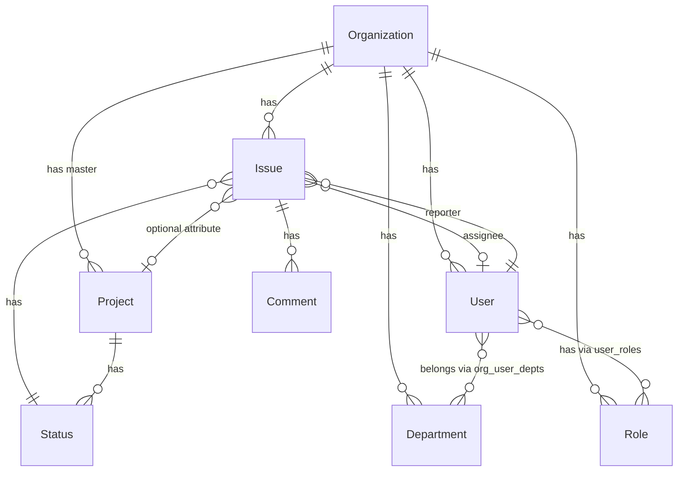

# ドメインモデル・エンティティ関係

エンティティ間の関係と設計方針をまとめたドキュメント。

**プロダクト方針**: 本プロジェクトは **Issue 管理システム**を主目的とする。稟議・承認ワークフロー専用のドメイン（Workflow / 承認ログ等）は **設計の中心から外す**（既存コードは移行・整理対象として扱う）。

**ステータス遷移の権限**（誰がカンバン上の列を変えてよいか）は [transition-permissions.md](transition-permissions.md) を参照（**採用案は議論中 / TBD**）。

---

## 会社（Organization）

- **プロジェクト**を持つ（1:N、プロジェクトテーブルのマスタ）
- **ユーザー**を持つ（users.organization_id 経由、1:N。1ユーザー＝1組織）
- **部署**を持つ（1:N）
- **役職（またはそれに相当する権限単位）**を持つ（1:N）
- **Issue**を持つ（1:N、会社に直接紐づく想定）

---

## 部署（Department）

- 会社に紐づく（organization_id）
- 例: 開発部、営業部、経理部 / 予算委員会、教育委員会
- **ユーザー**を持つ（組織内でユーザーが部署に所属。1ユーザーが複数部署に所属可能 → N:M）

> **Note:** 部署は組織構造のための概念。**「営業部の課長のみ Close」**のような **部署スコープ付きの遷移権限**を表現するために重要になりうる（詳細は [transition-permissions.md](transition-permissions.md)）。役職／グループとの関係も同ドキュメントで整理する。

---

## プロジェクト（Project）

- **Issue の一要素**としてのみ存在。Issue 以外のエンティティ（会社、部署、ユーザーなど）と**不必要に**直接結び付く設計は避ける。
- **期間**を持つ
  - 開始日（start_date）
  - 終了日（end_date）
- **ライフサイクルステータス**を持つ（Issue の statuses とは別概念）
  - 用途: クエリのキー、表示上のフラグ
  - 値: `none` | `planning` | `active` | `completed`
  - 表示例: なし / 計画中 / 実行中 / 完了

> **Note:** プロジェクトは Issue のグルーピング用属性。プロジェクトテーブルは必要で、会社がマスタとして持つ。

---

## ユーザー（User）

- **役職等**を持つ（user_roles 経由、N:M）
- **会社**に所属する（users.organization_id、1:1。1ユーザー＝1組織）
  - 同一人物が複数社に所属する場合は、組織ごとに別ユーザーレコード
  - ログイン後の会社切替は、内部的には別ユーザーIDに切替
- **部署**に所属する（組織ごとに。organization_user_departments 経由、N:M）
  - 例: 同一組織内で「開発部」と「予算委員会」の両方に所属

---

## ステータス（Status）と Issue

- Issue は **`status_id`** を持ち、Status がカンバンの**列**を定義する。
- **ステータス遷移の権限**（例: 完了列へ誰が移動できるか）は、**承認フローとは独立**に設計する。候補・用語・ルールは [transition-permissions.md](transition-permissions.md)。

---

## カンバン表示

**可能。** Issue は `status_id` を持ち、Status がカラム（列）を定義する。

- **表示**: Status を列、Issue をカードとして配置
- **操作**: Issue の status_id を変更することでカードを列間で移動（権限チェックは [transition-permissions.md](transition-permissions.md) の合意に従う）
- **スコープ**: 現状は Status が Project に紐づくため、カンバンはプロジェクト単位。将来、Issue がプロジェクト未紐づけを許容する場合、組織単位の Status またはデフォルト Status の検討が必要

---

## 役職（Role）／権限グループ（名称 TBD）

- 会社に紐づく（organization_id）
- **ワークフロー承認用の required_level** という位置づけは、**Issue 管理方針では採用しない**。`level` 等の属性は、**ステータス遷移の門番**や **グループ的な表現**に再利用するかは [transition-permissions.md](transition-permissions.md) で決定する。

---

## Issue

中心的なエンティティ。チケット・タスク・案件などを表す。

- **会社**に紐づく（organization_id）
- **プロジェクト**を持つ（0..1、オプショナル）
  - プロジェクトは Issue の一要素。Issue のグルーピング・フィルタ用
- **ワークフロー（Workflow）を Issue に紐づける設計は行わない**（方針上の対象外）

> **Note:** 現状実装では project_id が必須（NOT NULL）の場合がある。将来、nullable に変更予定。

---

## Issue テンプレート（IssueTemplate）

- Issue 作成時のプリセット（タイトル・説明・既定優先度など）。
- **ワークフロー ID をテンプレートに持たせる設計は、ドキュメント上は廃止**（実装から削除するかは別タスク）。

---

## 関係図（Issue 管理を中心にした整理）

---

## 部署（Department）の設計詳細

| 項目 | 内容 |
|------|------|
| テーブル | departments (id, organization_id, name, order?, created_at) |
| 中間テーブル | organization_user_departments (organization_id, user_id, department_id) |
| ユーザー・部署 | 組織内で N:M（1人が複数部署に所属可能） |
| 組織との関係 | 組織に紐づく（組織をまたいだ部署の共有はしない） |

---

## 実装・ドキュメントとの差異メモ

| 項目 | メモ |
|------|------|
| Department | 設計上は上記。実装の有無は [db-schema.md](db-schema.md) およびコードを参照。 |
| Workflow / IssueApproval 等 | **Issue 管理の正規ドメインから除外**。コードに残る場合はレガシーとして移行・削除を検討。 |
| Issue の organization_id | 設計上は会社に直接紐づく想定。実装との整合は db-schema を参照。 |
