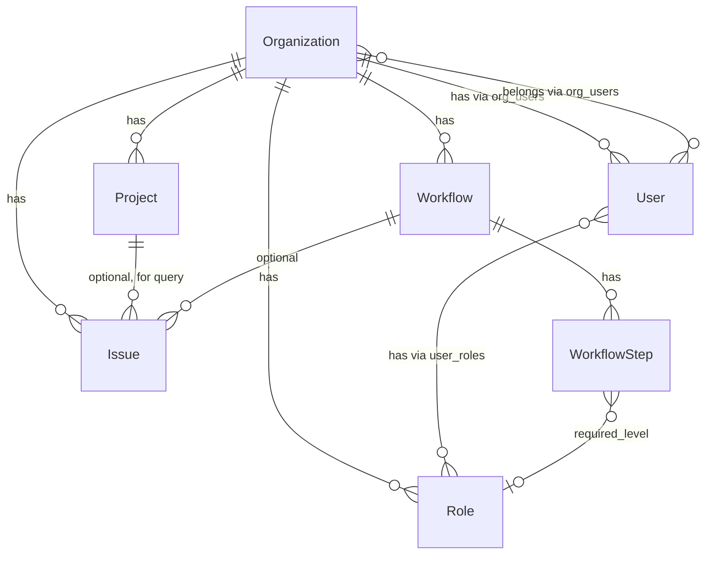

# ドメインモデル・エンティティ関係

エンティティ間の関係と設計方針をまとめたドキュメント。

---

## 会社（Organization）

- **プロジェクト**を持つ（1:N）
- **ユーザー**を持つ（organization_users 経由、N:M）
- **ワークフロー**を持つ（1:N）
- **役職**を持つ（1:N）
- **Issue**を持つ（プロジェクト経由で間接的に持つ。Issue がプロジェクト未紐づけの場合は会社に直接紐づく想定）

---

## プロジェクト（Project）

- **期間**を持つ
  - 開始日（start_date）
  - 終了日（end_date）
- **ライフサイクルステータス**を持つ（Issue の statuses とは別概念）
  - 用途: クエリのキー、表示上のフラグ
  - 値: `none` | `planning` | `active` | `completed`
  - 表示例: なし / 計画中 / 実行中 / 完了

> **Note:** プロジェクトは主に「クエリのためのグループ化キー」としての役割。Issue をプロジェクトでフィルタ・集約する用途。

---

## ユーザー（User）

- **役職**を持つ（user_roles 経由、N:M）
- **会社**に所属する（organization_users 経由、N:M）
  - 1社のみ → ログイン後はラベル表示
  - 複数社 → ログイン後にプルダウンで切替

---

## ワークフロー（Workflow）

- **役職**を持つ（WorkflowStep の required_level で役職レベルを指定）
- **プロジェクトに縛られない** → 会社に紐づく（organization_id）

> **Note:** 現状は project_id でプロジェクトに紐づいている。将来、organization_id に変更予定。

---

## 役職（Role）

- 会社に紐づく（organization_id）
- ワークフローステップの承認に必要なレベル（required_level）と対応

---

## Issue

- **ワークフロー**を持つ（0..1、オプショナル）
- **プロジェクト**を持つ（0..1、オプショナル）
  - プロジェクトに紐づく: プロジェクト単位でフィルタ・表示
  - プロジェクトに紐づかない: 会社全体の「プロジェクト未割当」として扱う

> **Note:** 現状は project_id が必須（NOT NULL）。将来、nullable に変更予定。その場合、Issue は会社（organization_id）に直接紐づく設計を検討。

---

## 関係図（将来の設計）

---

## 現状との差異（実装予定）

| 項目 | 現状 | 設計方針 |
|------|------|----------|
| Workflow | project_id（プロジェクトに紐づく） | organization_id（会社に紐づく） |
| Project | 期間・ライフサイクルステータスなし | start_date, end_date, status(none/planning/active/completed) を追加 |
| Issue | project_id 必須 | project_id を nullable（プロジェクト未割当を許容） |
| Issue | organization_id なし | organization_id を追加（会社に直接紐づく） |
