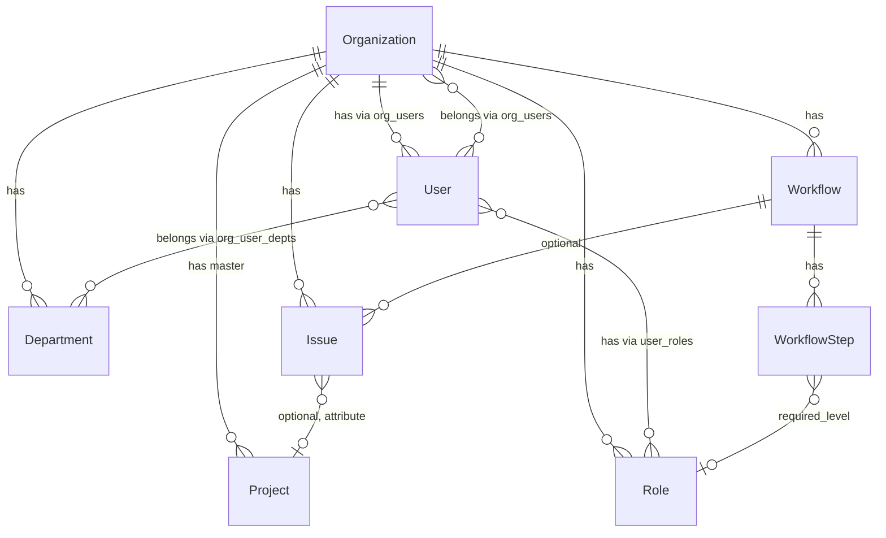

# ドメインモデル・エンティティ関係

エンティティ間の関係と設計方針をまとめたドキュメント。

---

## 会社（Organization）

- **プロジェクト**を持つ（1:N、プロジェクトテーブルのマスタ）
- **ユーザー**を持つ（organization_users 経由、N:M）
- **部署**を持つ（1:N）
- **ワークフロー**を持つ（1:N）
- **役職**を持つ（1:N）
- **Issue**を持つ（1:N、会社に直接紐づく）

---

## 部署（Department）

- 会社に紐づく（organization_id）
- 例: 開発部、営業部、経理部 / 予算委員会、教育委員会
- **ユーザー**を持つ（組織内でユーザーが部署に所属。1ユーザーが複数部署に所属可能 → N:M）

> **Note:** 役職（Role）は承認・権限のための概念。部署は組織構造のための概念。ユーザーは両方を持つ（例: 開発部の部長 → 部署=開発部、役職=部長）。

---

## プロジェクト（Project）

- **Issue の一要素**としてのみ存在。Issue 以外のエンティティ（会社、部署、ユーザー、ワークフローなど）と直接結び付く設計は避ける。
- **期間**を持つ
  - 開始日（start_date）
  - 終了日（end_date）
- **ライフサイクルステータス**を持つ（Issue の statuses とは別概念）
  - 用途: クエリのキー、表示上のフラグ
  - 値: `none` | `planning` | `active` | `completed`
  - 表示例: なし / 計画中 / 実行中 / 完了

> **Note:** プロジェクトは Issue のグルーピング用属性。Issue をプロジェクトでフィルタ・集約する用途。プロジェクトテーブルは必要で、会社がマスタとして持つ。ただしプロジェクトは Issue 以外のエンティティ（部署、ユーザーなど）と直接結び付かない。

---

## ユーザー（User）

- **役職**を持つ（user_roles 経由、N:M）
- **会社**に所属する（organization_users 経由、N:M）
  - 1社のみ → ログイン後はラベル表示
  - 複数社 → ログイン後にプルダウンで切替
- **部署**に所属する（組織ごとに。organization_user_departments 経由、N:M）
  - 例: 同一組織内で「開発部」と「予算委員会」の両方に所属

---

## ワークフロー（Workflow）

- **総ステップ数**を持つ（WorkflowStep の数）
- **1 ステップごとに承認対象**を指定。現状は役職のみだが、以下をサポートする設計に拡張:
  - **役職**: 指定レベル以上の役職を持つ人が承認可能（例: 部長以上）
  - **個人**: 特定の 1 人を指定（例: 〇〇さん）
  - **複数人**: N 人から承認が必要（例: 2 人以上の LGTM）
- **組織・プロジェクトに属さない** → グローバル

> **Note:** 現状は project_id でプロジェクトに紐づき、役職（required_level）のみ。構造が大きく変わる。

---

## ワークフローの機能要件

以下のすべてのユースケースをサポートする設計とする。

### 1. コードレビュー（レビュアーとレビュイーの関係）

- **要件**: 自分以外の 2 人以上から LGTM をもらう
- **パターン**: 同一ステップで複数承認者（並列）
- **設計**:
  - WorkflowStep に `min_approvers`（最低承認者数）を追加。例: 2
  - `exclude_reporter`, `exclude_assignee` で起票者・担当者を承認者から除外
  - 同一ステップ内で N 人から承認を得るまで完了しない

### 2. 日々の簡単な業務

- **要件**: 軽い承認で済む日常業務
- **パターン**: 1 ステップ、低いレベル、またはワークフローなし
- **設計**:
  - 1 ステップ、required_level=1（誰でも可）のワークフロー
  - または Issue にワークフローを紐づけない（承認不要）

### 3. 高額購入（上席 → 部長 → 取締役員の承諾）

- **要件**: 上席、部長、取締役員の順で承諾が必要
- **パターン**: 順次承認（ステップを順に通過）
- **設計**:
  - Step1: required_level=1（上席相当）
  - Step2: required_level=2（部長相当）
  - Step3: required_level=3（取締役員相当）
  - 役職の level で承認権限を表現。前ステップ完了後に次ステップが有効

### 4. 最終的に社長の承諾が必要

- **要件**: ワークフローの最後に社長承認を必須とする
- **パターン**: 順次承認の最終ステップ
- **設計**:
  - 最終ステップに required_level=4（社長相当）を設定
  - 上記 3 のワークフローに Step4 を追加: required_level=4（社長）

---

### ワークフロー設計の拡張（実装予定）

**承認対象の種類（1 ステップごとにいずれか）**

| 種類 | 説明 | 例 |
|------|------|-----|
| 役職 | 指定レベル以上の役職を持つ人が承認 | 部長以上、取締役員 |
| 個人 | 特定の 1 人を指定 | 〇〇さん、担当者の上席 |
| 複数人 | N 人から承認が必要（誰でも可 or 条件付き） | 2 人以上の LGTM、自分以外の 2 人 |

**その他拡張**

| 項目 | 現状 | 拡張 |
|------|------|------|
| WorkflowStep の承認対象 | 役職（required_level）のみ | 役職 / 個人 / 複数人 を選択可能 |
| WorkflowStep.min_approvers | 1 人想定 | N 人（例: 2）から承認が必要 |
| WorkflowStep.exclude_reporter | なし | 起票者を承認者から除外 |
| WorkflowStep.exclude_assignee | なし | 担当者を承認者から除外 |
| 承認パターン | 順次のみ | 順次 + 同一ステップ内の並列複数承認 |

---

## カンバン表示

**可能。** Issue は `status_id` を持ち、Status がカラム（列）を定義する。

- **表示**: Status を列、Issue をカードとして配置
- **操作**: Issue の status_id を変更することでカードを列間で移動
- **スコープ**: 現状は Status が Project に紐づくため、カンバンはプロジェクト単位。将来、Issue がプロジェクト未紐づけを許容する場合、組織単位の Status またはデフォルト Status の検討が必要

---

## 役職（Role）

- 会社に紐づく（organization_id）
- ワークフローステップの承認に必要なレベル（required_level）と対応

---

## Issue

中心的なエンティティ。チケット・タスク・案件などを表す。

- **会社**に紐づく（organization_id）
- **ワークフロー**を持つ（0..1、オプショナル）
- **プロジェクト**を持つ（0..1、オプショナル）
  - プロジェクトは Issue の一要素。Issue のグルーピング・フィルタ用
  - プロジェクトに紐づく: プロジェクト単位でフィルタ・表示
  - プロジェクトに紐づかない: 会社全体の「プロジェクト未割当」として扱う

> **Note:** 現状は project_id が必須（NOT NULL）。将来、nullable に変更予定。

---

## 関係図（将来の設計）

> **Note:** Project は Issue の一要素。会社がプロジェクトテーブルをマスタとして持つ。Issue がプロジェクトを属性として参照する。

---

## 部署（Department）の設計詳細

| 項目 | 内容 |
|------|------|
| テーブル | departments (id, organization_id, name, order?, created_at) |
| 中間テーブル | organization_user_departments (organization_id, user_id, department_id) |
| ユーザー・部署 | 組織内で N:M（1人が複数部署に所属可能。例: 開発部 + 予算委員会） |
| 組織との関係 | 組織に紐づく（組織をまたいだ部署の共有はしない） |

---

## 現状との差異（実装予定）

| 項目 | 現状 | 設計方針 |
|------|------|----------|
| Department | なし | 新規: departments, organization_user_departments |
| Workflow | project_id（プロジェクトに紐づく） | organization_id（会社に紐づく） |
| WorkflowStep | 役職（required_level）のみ | 役職/個人/複数人を選択、min_approvers, exclude_reporter, exclude_assignee |
| Project | 期間・ライフサイクルステータスなし | start_date, end_date, status(none/planning/active/completed) を追加 |
| Issue | project_id 必須 | project_id を nullable（プロジェクト未割当を許容） |
| Issue | organization_id なし | organization_id を追加（会社に直接紐づく） |
