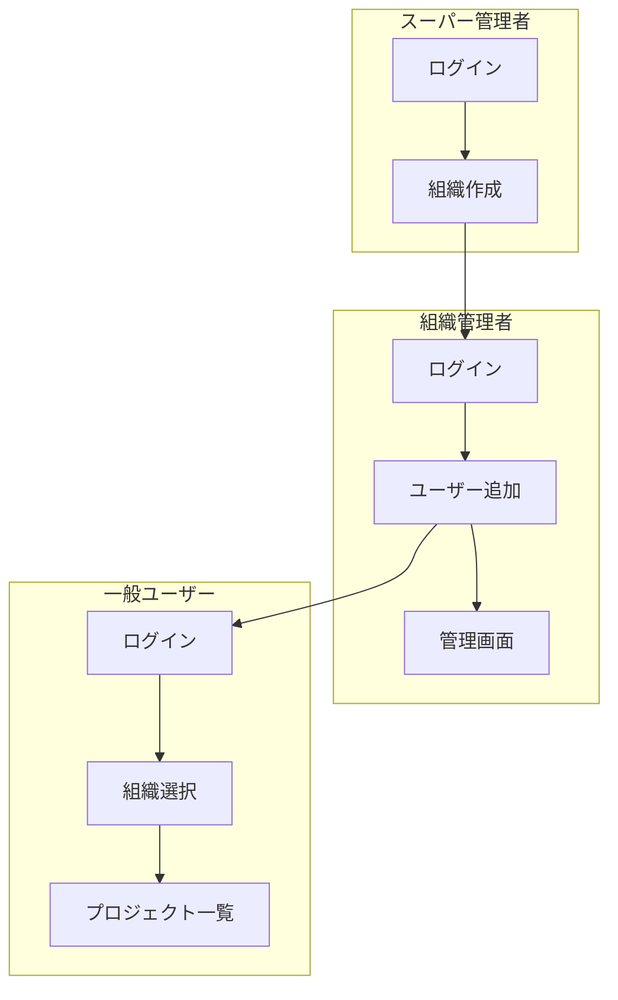

# 主要フロー

## 認証フロー

### 認証・認可ポリシー（全体）

- 認証は JWT を使用する。
- JWT はフロントエンドでメモリ（State/Context）を主軸に保持し、リロード耐性とログアウト対策として `sessionStorage` を併用する（マルチセッション維持）。
- バックエンドは JWT の `organization_id` を用いて、スーパーアドミン以外のレスポンスを所属組織スコープに制限する。

### 一般ユーザー / 組織管理者

- **ログイン URL**: `/login`
- **方式**: メールアドレスのみ（パスワードなし）+ JWT
- **流れ**:
  1. メールアドレスを入力してログイン
  2. 既存ユーザーならそのまま、未登録なら `POST /users` でユーザー作成後にログイン
  3. 所属組織が 1 件 → 自動選択してプロジェクト一覧へ
  4. 所属組織が複数 → `/select-org` で組織を選択してからプロジェクト一覧へ
- **管理画面**: ログイン画面で「管理者としてログイン」にチェックを付けると `/admin` にアクセス可能（組織管理者または is_admin ユーザーのみ）

### スーパー管理者

- **ログイン URL**: `/super-admin/login`
- **方式**: メールアドレスのみ（`POST /super-admin/login`）+ JWT
- **流れ**:
  1. メールアドレスを入力
  2. `super_admins` テーブルに存在すればログイン成功
  3. 組織の作成・一覧のみ可能（`GET/POST /super-admin/organizations`）
- **初期アカウント**: seed.sql 実行後、`superadmin@frs.example.com` でログイン可能

---

## マルチテナントフロー

### 組織の作成

1. スーパー管理者が `POST /super-admin/organizations` で組織を作成
2. 組織作成時に、指定メールアドレスのユーザーが組織管理者として作成される（users.organization_id, is_org_admin）

### 組織管理者によるユーザー管理

- `GET /admin/users?org_id=xxx` で組織内ユーザー一覧
- `POST /admin/users` で組織にユーザーを作成（1ユーザー＝1組織）
- `PUT /admin/users/:id` でユーザー更新
- `DELETE /admin/users/:id` でユーザーを削除（1ユーザー＝1組織のため、org_id で確認後に削除）

**読み分け**: 一覧でクエリの `org_id` を付けるのか、パスの `:id` で親を引いてから子を列挙するのかは、[tenant-invariants.md](tenant-invariants.md) と [api-spec.md](api-spec.md) の「テナント境界のパターン」で揃える。

---

## ステータス遷移の権限（Issue 管理）

**稟議・承認ワークフロー（誰が許可したかの証跡）とは別**に、「**誰が Issue のステータス（カンバンの列）を変更してよいか**」を制御する。詳細・候補案・未決事項は [transition-permissions.md](transition-permissions.md) を参照（**採用案は TBD**）。

### ざっくりした流れ（概念）

1. ユーザーが Issue の `status_id` を変更する（またはカンバンでドラッグする）。
2. バックエンドは **遷移ルール**（組織・部署・役職／グループ等）に照らし、操作者の権限を検証する。
3. ルールは **特定ユーザー ID に Close を結び付けない**方向で設計する（人事異動時の運用を考慮）。

### 将来のフロー図（確定後に Mermaid を追記）

合意後、`domain-model.md` / `db-schema.md` と整合する図をここに置く。

---

## フロントエンドの主要画面遷移

| 画面 | パス | 説明 |
|------|------|------|
| ログイン（一般） | /login | メールアドレスでログイン |
| ログイン（SuperAdmin） | /super-admin/login | スーパー管理者ログイン |
| 組織選択 | /select-org | 所属組織が複数ある場合 |
| プロジェクト一覧 | /projects | プロジェクト一覧 |
| プロジェクト詳細 | /projects/[id] | プロジェクト内 Issue 一覧 |
| Issue 詳細 | /projects/[id]/issues/[number] | Issue 詳細・コメント・ステータス変更 |
| 管理画面 | /admin | ユーザー・グループ・ステータス・プロジェクト・ワークフロー・テンプレート等（管理メニューは実装に合わせる） |
