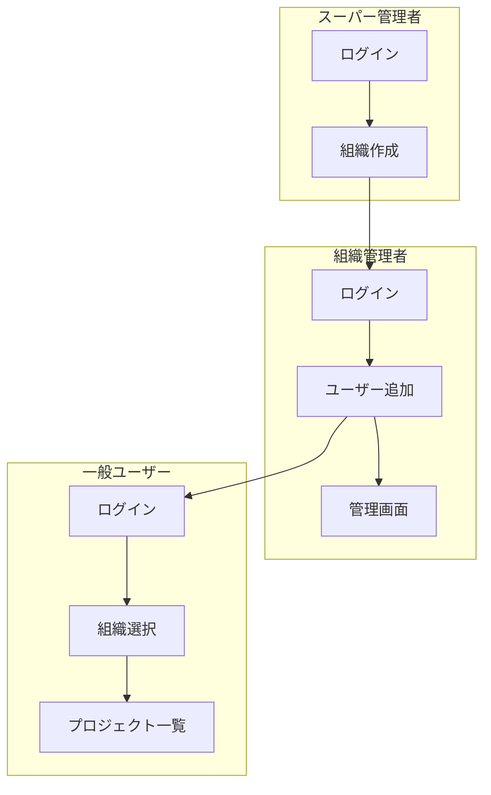
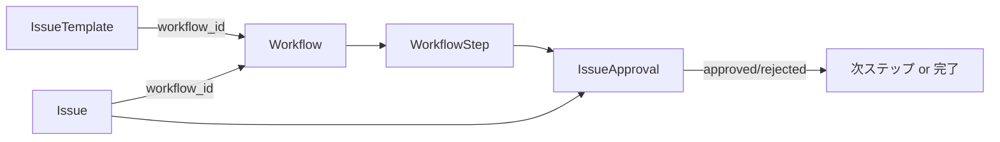

# 主要フロー

## 認証フロー

### 認証・認可ポリシー（全体）

- 認証は JWT を使用する。
- JWT はフロントエンドでメモリ（State/Context）を主軸に保持し、リロード耐性とログアウト対策として `sessionStorage` を併用する（マルチセッション維持）。
- バックエンドは JWT の `organization_id` を用いて、スーパーアドミン以外のレスポンスを所属組織スコープに制限する。

### 一般ユーザー / 組織管理者

- **ログイン URL**: `/login`
- **方式**: メールアドレスのみ（パスワードなし）+ JWT
- **流れ**:
  1. メールアドレスを入力してログイン
  2. 既存ユーザーならそのまま、未登録なら `POST /users` でユーザー作成後にログイン
  3. 所属組織が 1 件 → 自動選択してプロジェクト一覧へ
  4. 所属組織が複数 → `/select-org` で組織を選択してからプロジェクト一覧へ
- **管理画面**: ログイン画面で「管理者としてログイン」にチェックを付けると `/admin` にアクセス可能（組織管理者または is_admin ユーザーのみ）

### スーパー管理者

- **ログイン URL**: `/super-admin/login`
- **方式**: メールアドレスのみ（`POST /super-admin/login`）+ JWT
- **流れ**:
  1. メールアドレスを入力
  2. `super_admins` テーブルに存在すればログイン成功
  3. 組織の作成・一覧のみ可能（`GET/POST /super-admin/organizations`）
- **初期アカウント**: seed.sql 実行後、`superadmin@frs.example.com` でログイン可能

---

## マルチテナントフロー

### 組織の作成

1. スーパー管理者が `POST /super-admin/organizations` で組織を作成
2. 組織作成時に、指定メールアドレスのユーザーが組織管理者として作成される（users.organization_id, is_org_admin）

### 組織管理者によるユーザー管理

- `GET /admin/users?org_id=xxx` で組織内ユーザー一覧
- `POST /admin/users` で組織にユーザーを作成（1ユーザー＝1組織）
- `PUT /admin/users/:id` でユーザー更新
- `DELETE /admin/users/:id` でユーザーを削除（1ユーザー＝1組織のため、org_id で確認後に削除）

---

## 承認フロー

### 概要

1. **Workflow**: プロジェクトに紐づく承認プロセス。複数の **WorkflowStep** を持つ。
2. **WorkflowStep**: 承認ステップ。`required_level` で必要な役職レベルを指定。`status_id` で紐づくステータスを指定可能。
3. **IssueTemplate**: Issue 作成時に使用。`workflow_id` を指定すると、その Issue に承認フローが適用される。
4. **IssueApproval**: Issue ごとの承認レコード。各 WorkflowStep に対応。`status` は pending / approved / rejected。

### 承認の流れ

1. テンプレートにワークフローを紐づけた Issue を作成
2. Issue 作成時に、ワークフローの各ステップに対応する `IssueApproval` が自動作成（status: pending）
3. 承認者は `POST /approvals/:id/approve` または `POST /approvals/:id/reject` で承認/却下
4. 承認者の `required_level` 以上の役職レベルが必要

---

## フロントエンドの主要画面遷移

| 画面 | パス | 説明 |
|------|------|------|
| ログイン（一般） | /login | メールアドレスでログイン |
| ログイン（SuperAdmin） | /super-admin/login | スーパー管理者ログイン |
| 組織選択 | /select-org | 所属組織が複数ある場合 |
| プロジェクト一覧 | /projects | プロジェクト一覧 |
| プロジェクト詳細 | /projects/[id] | プロジェクト内 Issue 一覧 |
| Issue 詳細 | /projects/[id]/issues/[number] | Issue 詳細・コメント・承認 |
| 管理画面 | /admin | ユーザー・役職・ワークフロー・テンプレート管理 |
