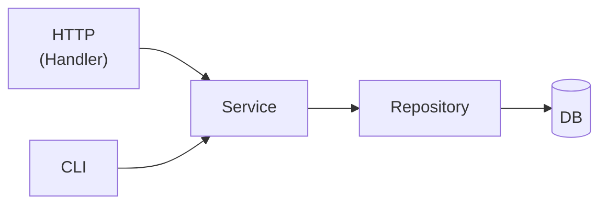

# レイヤー責務定義

## 基本方針

**「Handlerを通じてできることは、CLIからも必ずできる」**

これを実現するために、ビジネスロジックはすべて Service レイヤーに集約する。
Handler は HTTP という「入口」の1つに過ぎない。Service はどの入口からでも呼び出せる。



---

## 各レイヤーの責務

### Handler（`internal/handler/`）

**「HTTP の入出力だけを担当する」**

| やること | やらないこと |
|---|---|
| URLパラメータ・クエリの取り出し | ビジネスルールの判定 |
| リクエストボディのパース（`c.Bind`） | デフォルト値の決定 |
| 入力値の形式チェック（UUID形式か、など） | 採番・ID生成 |
| Service の呼び出し | DB への直接アクセス |
| HTTPステータスコードとレスポンスの返却 | |

**判断基準：「このコードは HTTP がなくても意味があるか？」**
→ YES なら Service に書く。NO（HTTPにしか意味がない）なら Handler に書く。

```go
// Handler の正しい姿
func (h *IssueHandler) Create(c echo.Context) error {
    projectID, _ := uuid.Parse(c.Param("projectId"))  // HTTP から取り出す
    var req CreateRequest
    c.Bind(&req)                                        // HTTP から取り出す
    issue, err := h.service.CreateIssue(projectID, req) // ロジックは Service へ
    return c.JSON(http.StatusCreated, issue)            // HTTP へ返す
}
```

---

### Service（`internal/service/`）

**「HTTPを知らない。CLIからでも呼び出せる形で書く」**

| やること | やらないこと |
|---|---|
| ビジネスルールの判定 | `echo.Context` の参照 |
| デフォルト値・初期値の決定 | HTTPステータスコードの判断 |
| UUID・連番など識別子の採番 | JSONのシリアライズ |
| 複数 Repository をまたぐ処理の調整 | |
| トランザクション管理 | |

**判断基準：「このコードを CLI から呼び出したとき、意味をなすか？」**
→ YES なら Service に書くべきロジック。

```go
// Service の正しい姿（HTTP を一切知らない）
func (s *IssueService) CreateIssue(projectID uuid.UUID, input CreateIssueInput) (*model.Issue, error) {
    nextNum, _ := s.issueRepo.NextNumber(projectID)  // 採番
    if input.Priority == "" {
        input.Priority = "medium"                     // デフォルト値
    }
    issue := &model.Issue{
        ID:        uuid.New(),
        Number:    nextNum,
        Title:     input.Title,
        Priority:  input.Priority,
        ProjectID: projectID,
        ...
    }
    return issue, s.issueRepo.Create(issue)
}
```

---

### Repository（`internal/repository/`）

**「DB の操作だけを担当する。ビジネスロジックを持たない」**

| やること | やらないこと |
|---|---|
| GORM を使った CRUD 操作 | ビジネスルールの判定 |
| Preload / Join によるリレーション取得 | デフォルト値の設定 |
| 検索条件・ソートの実装 | 複数テーブルをまたぐビジネス的な整合性チェック |

---

## 呼び出し関係のルール

```
Handler  →  Service    ✅ OK
Handler  →  Repository ❌ NG（Handler が DB を直接触らない）
Service  →  Repository ✅ OK
Service  →  Handler    ❌ NG（循環依存）
Repository → Service  ❌ NG（循環依存）
```

---

## CLI 対応の指針

将来 `backend/cmd/cli/` を追加する場合も、Service をそのまま呼び出す。

```
backend/
├── cmd/
│   ├── server/   ← Echo サーバー（Handler → Service を呼ぶ）
│   └── cli/      ← CLI ツール（直接 Service を呼ぶ）
├── internal/
│   ├── handler/
│   ├── service/
│   └── repository/
```

Service のインターフェースを変えない限り、CLI 追加による既存コードへの影響はゼロになる。

---

## 境界線の具体例（Issue 作成）

| 処理 | 担当レイヤー | 理由 |
|---|---|---|
| `c.Param("projectId")` の取り出し | Handler | HTTP にしか存在しない |
| `c.Bind(&req)` | Handler | HTTP にしか存在しない |
| UUID 形式かチェック | Handler | 入力フォーマットの検証 |
| Issue 番号の連番採番 | Service | CLI からでも同じ採番が必要 |
| デフォルト優先度（medium）の設定 | Service | CLI からでも同じルールが必要 |
| `uuid.New()` で ID 生成 | Service | CLIからでも ID が必要 |
| `issueRepo.Create()` 呼び出し | Service | DB 操作の起点はServiceから |
| `INSERT INTO issues ...` の実行 | Repository | DB 操作の実装 |
| `c.JSON(201, issue)` | Handler | HTTP にしか存在しない |
