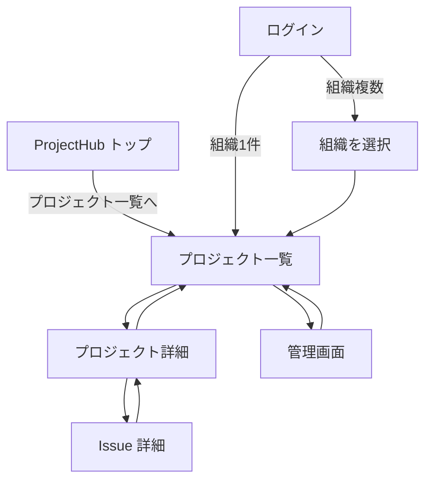
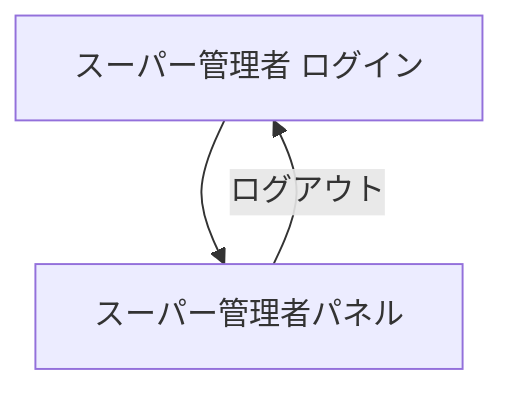

# 画面遷移フロー

画面間の遷移を一覧化・可視化する。詳細は [key-flows.md](../key-flows.md) を参照。

---

## 画面と v_xxx.md の対応

| パス | 画面表示名（日本語） | v_xxx.md |
|------|---------------------|----------|
| / | ProjectHub（トップ） | [v_home.md](v_home.md) |
| /login | ログイン | [v_login.md](v_login.md) |
| /super-admin/login | スーパー管理者 / 管理者ログイン | [v_super_admin_login.md](v_super_admin_login.md) |
| /super-admin | スーパー管理者パネル | [v_super_admin.md](v_super_admin.md) |
| /select-org | 組織を選択 | [v_select_org.md](v_select_org.md) |
| /projects | プロジェクト一覧 | [v_projects.md](v_projects.md) |
| /projects/[id] | プロジェクト詳細（プロジェクト名表示） | [v_project_detail.md](v_project_detail.md) |
| /projects/[id]/issues/[number] | Issue 詳細 | [v_issue_detail.md](v_issue_detail.md) |
| /admin | 管理画面 | [v_admin.md](v_admin.md) |
| /admin/users | ユーザー管理 | [v_admin_users.md](v_admin_users.md) |
| /admin/groups | グループ管理 | [v_admin_groups.md](v_admin_groups.md) |
| /admin/statuses | ステータス管理 | [v_admin_statuses.md](v_admin_statuses.md) |
| /admin/projects | プロジェクト管理 | [v_admin_projects.md](v_admin_projects.md) |
| /admin/projects/[id] | プロジェクト編集 | [v_admin_project_detail.md](v_admin_project_detail.md) |
| /admin/templates | Issueテンプレート管理 | [v_admin_templates.md](v_admin_templates.md) |

---

## 遷移図（一般ユーザー・組織管理者）

---

## 遷移図（スーパー管理者）

---

## 認証別の遷移パス

| 種別 | 入口 | 主な遷移先 |
|------|------|------------|
| 一般ユーザー | /login | /select-org（組織複数時）→ /projects → /projects/[id] → /projects/[id]/issues/[number] |
| 組織管理者 | /login（管理者としてログイン） | 上記 + /admin 配下（ユーザー・グループ・ステータス・プロジェクト・ワークフロー・テンプレート等） |
| スーパー管理者 | /super-admin/login | /super-admin（組織作成・一覧） |
